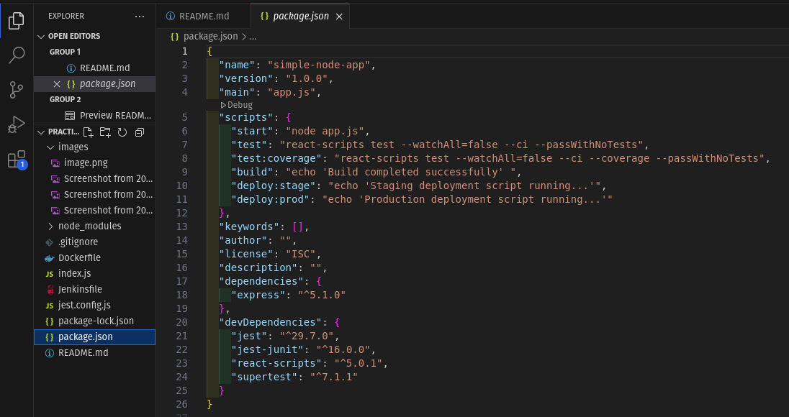
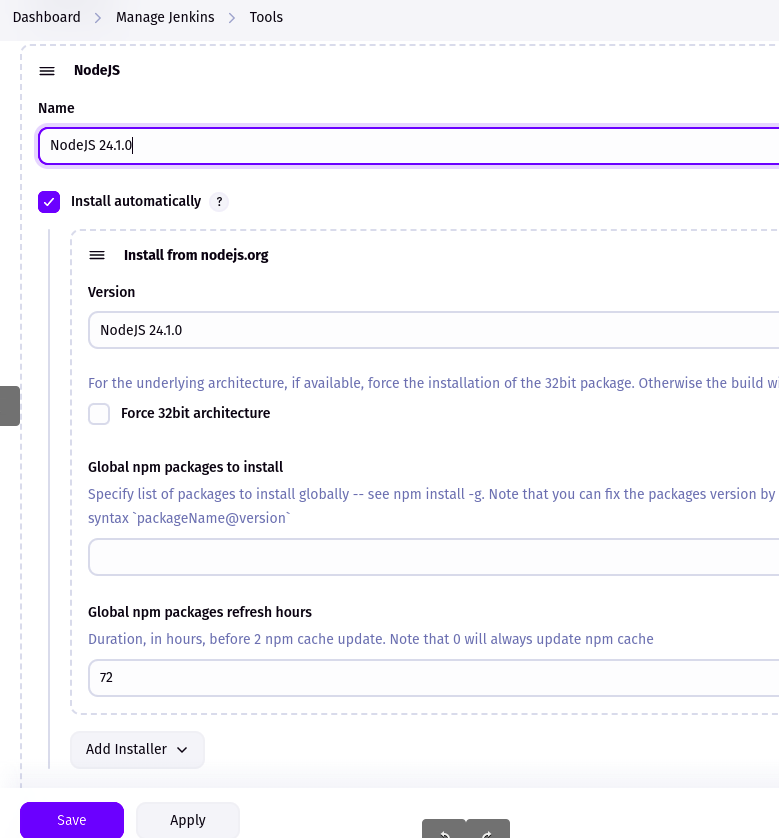
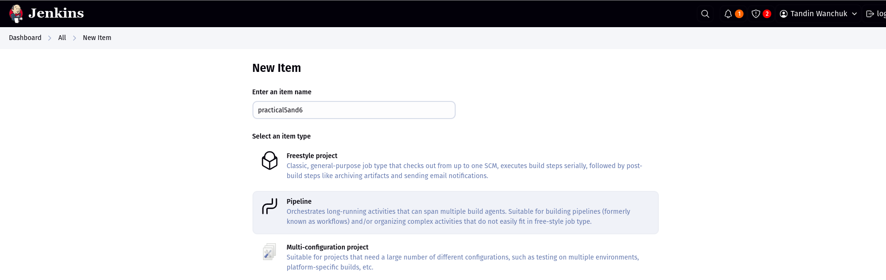
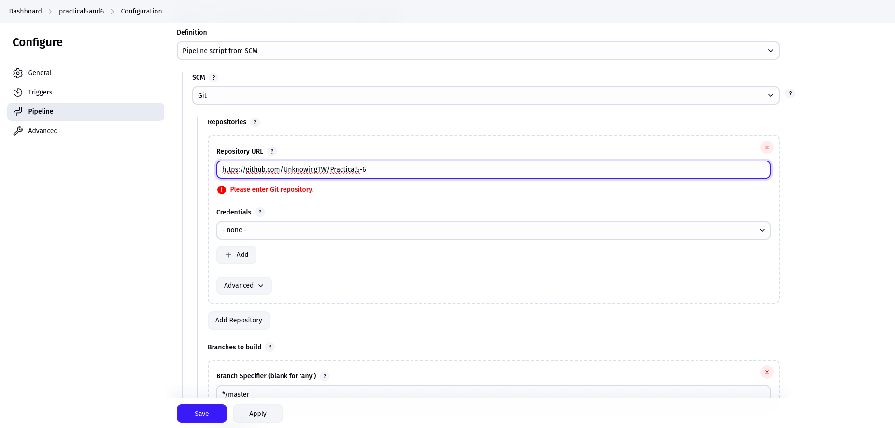
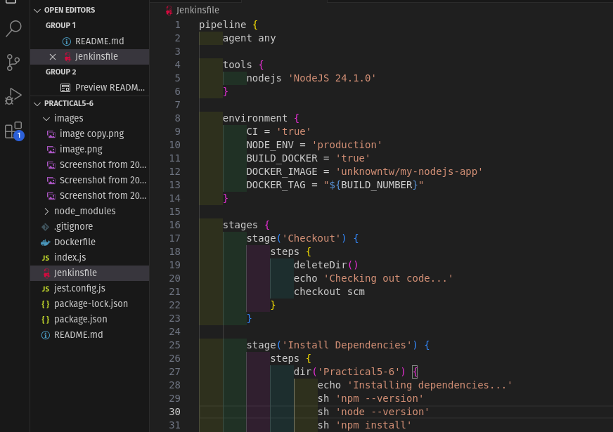
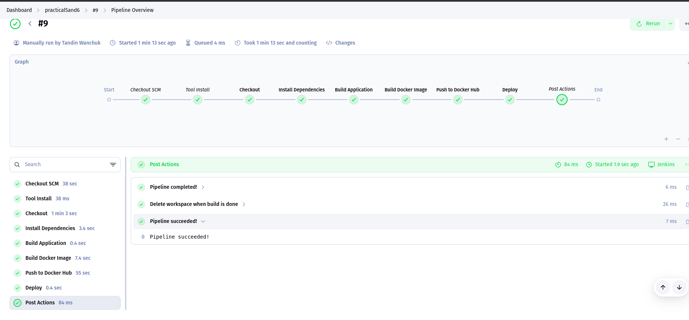
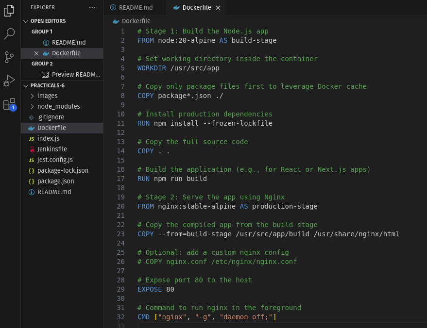
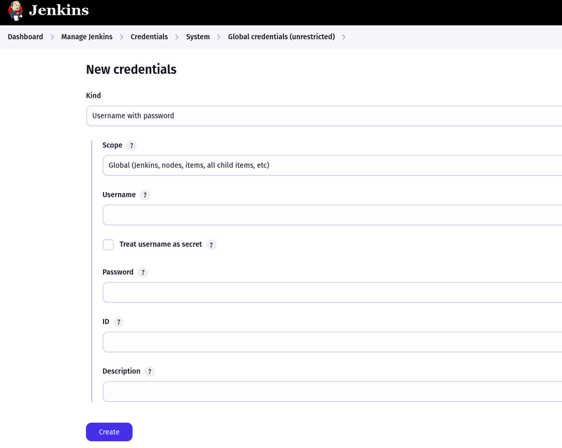
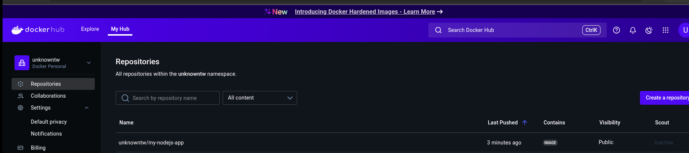

# Practicals 5 and 6: Declarative pipeline for Jenkins and using external services

## Aims:

The goal of this project is to develop a comprehensive CI/CD pipeline for a React application using Jenkins Declarative Pipeline. The pipeline will automate testing, building, Docker containerization, and deployment processes to showcase efficient and modern DevOps practices.

## Steps:
### First step: React Application Setup:

i. Set up a React application

ii. Updated package.json scripts to support CI/CD workflows

## 2nd steps:

i. Install Required Plugins
All necessary plugins were already installed during the previous assignment.

ii. Configure Global Tools
Configured Node.js version 24.0.2 in the Global Tool Configuration.
The installation was named "NodeJS 24.0.2" for reference within the pipeline.

iii. Create Pipeline Job

Configure SCM: Provided the Git repository URL for source code management.

Set Script Path: Defined the script path as Jenkinsfile for pipeline execution.

## 3rd steps:

i. Set Up the Initial Pipeline Structure

ii. Pipeline Stages Overview

- Checkout: Clones the repository and gathers branch metadata.

- Install Dependencies: Installs project dependencies using npm ci, with robust error handling.

- Run Tests: Executes the test suite and generates reports in JUnit format.

- Build Application: Produces a production-optimized build of the React app.

- Docker Build: Builds a Docker image using a multi-stage approach for efficiency.

- Push to Docker Hub: Authenticates and pushes the Docker image to Docker Hub securely.

- Cleanup: Removes unused Docker images to conserve system resources.

- Deploy Application: Deploys the built image to the designated environment based on configuration.

iii. Execute Pipeline in Jenkins

= took 9 attempts to be successful

## 4th Step: Docker Integration (Part 2: Challenge)

### Objective
Extend your pipeline to:
1. Build a Docker image of your Node.js application
2. Push the image to Docker Hub (or another container registry)
3. Secure your credentials using Jenkins secrets

## Reference:

https://medium.com/swlh/jenkins-pipeline-to-create-docker-image-and-push-to-docker-hub-721919512f2

https://gcore.com/learning/building-docker-images-to-docker-hub-using-jenkins-pipelines

i. Create Dockerfile

ii. Configure Credentials for Docker Hub Access

iii. Executed pipeline in Jenkins

Image in dockerhub

### Chalanges Faced & Solutions:
1. Pipeline Execution Issues

.  Challenge: Pipeline execution failed multiple times (took 9 attempts).

.  Solution:Added print statements to show progress and errors at each stage, making it easier to identify where the pipeline was failing.

2. Deployment

. Challenge: Deployment stage not working due to missing configurations.

.  Solution: Ensured that environment variables and Docker image tags were passed correctly, and deployment script was tested independently before pipeline integration.

3. Docker Integration

Faced lots of challenges over here:

i. Challenge: Not running on Jenkins host.

. Solution: Added Jenkins user to the Docker group.

ii. Challenge: Permission denied when pushing to Docker Hub.

.  Solution: Stored Docker Hub credentials securely using Jenkins Credentials Manager and referenced them using withCredentials.

iii. Challenge: Large image size or inefficient Dockerfile.

.  Solution: Optimized Dockerfile with a multi-stage build to reduce image size and improve build performance.

## Conclusion

This practical was a great way to learn how to set up a real CI/CD pipeline using Jenkins. We started with a basic React app and ended up automating everything—from testing and building to creating Docker images and deploying the app. There were some issues along the way, but fixing them helped us understand how DevOps works in real projects. Overall, it was a good learning experience and made the whole process feel more real and useful.
