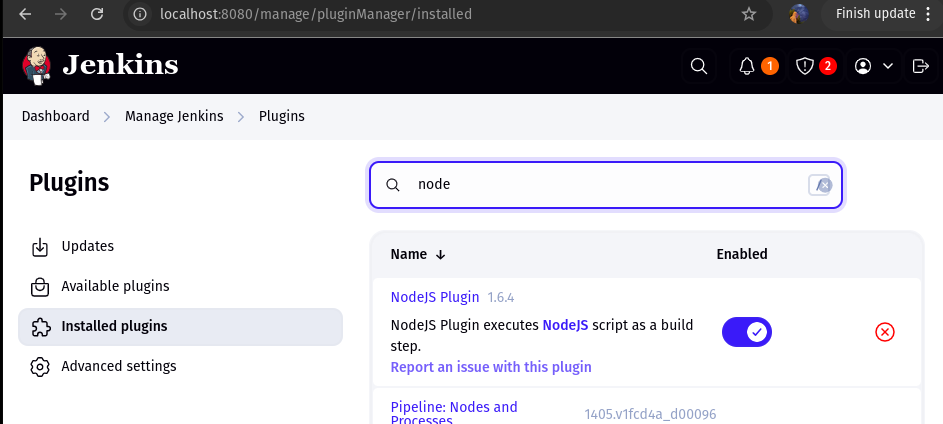
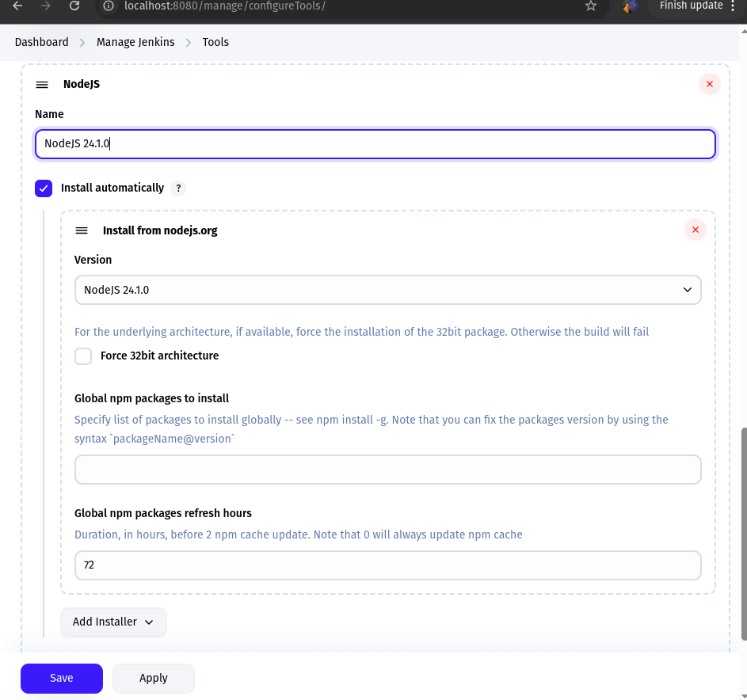
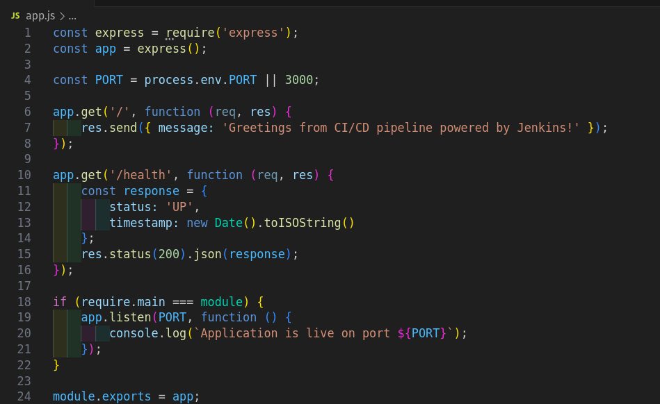
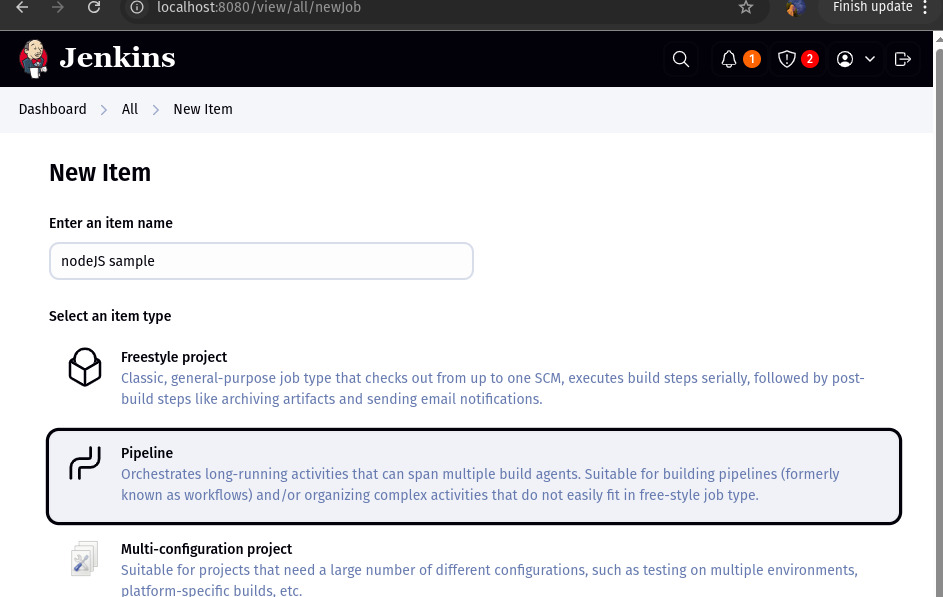
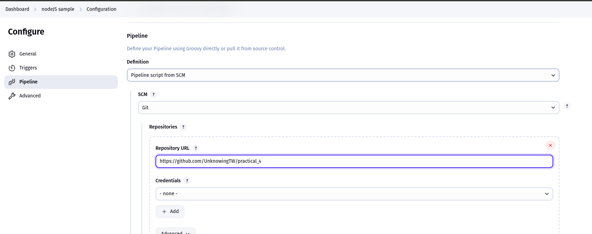
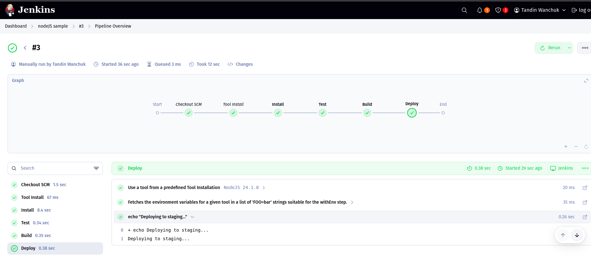

# Practical 4: Jenkins Server for Git Repository

## Jenkins CI/CD Pipeline for Node.js Applications

### Aims:

#### The main goal of this initiative is to design and execute a fully functional CI/CD workflow tailored for a Node.js project, utilizing Jenkins as the automation server. This hands-on task focused on:

- Installing and configuring Jenkins to serve as the foundation for continuous integration and deployment.

- Developing a Node.js application that incorporates automated testing mechanisms.

- Creating a Jenkins pipeline capable of detecting code changes and triggering a sequence of build, test, and deployment processes automatically.

### Proceduers followed:
 i. Install plugins needed

 ii. Node.js Tool Configuration

 
 
iii. Created Node.js Application

 iV. Create jenkins pipeline job

v. Configured Jenkins to load the pipeline script directly from SCM

vi. Set up a Jenkinsfile to orchestrate a multi-phase CI/CD pipeline:

Source Checkout: Pulled application code from the configured Git repository via SCM.

Dependency Installation: Installed required Node.js modules using npm install.

Test Execution: Ran automated tests with coverage analysis to ensure code quality.

Build Phase: Compiled and prepared the application for deployment.

Artifact Archiving: Saved build artifacts for future use or reference.

Deployment Step: Simulated deployment to a staging environment for validation.

vii. Run pipeline in jenkins

## Problems faced & there Solutions:
    Jenkinsfile Not Found or Pipeline Fails to Load

Problem: Jenkins failed to locate the Jenkinsfile in the SCM repo, resulting in pipeline errors.

Solution:Had to ensure the Jenkinsfile is committed at the root of the repository and
confirm the branch name and script path are correctly defined in the pipeline job config.

## Conclusion
This practical demonstrates how Jenkins can be configured to automate building, testing, and deploying a Node.js application through pipelines, facilitating continuous integration and delivery with automated test reporting for quicker and more dependable software releases.