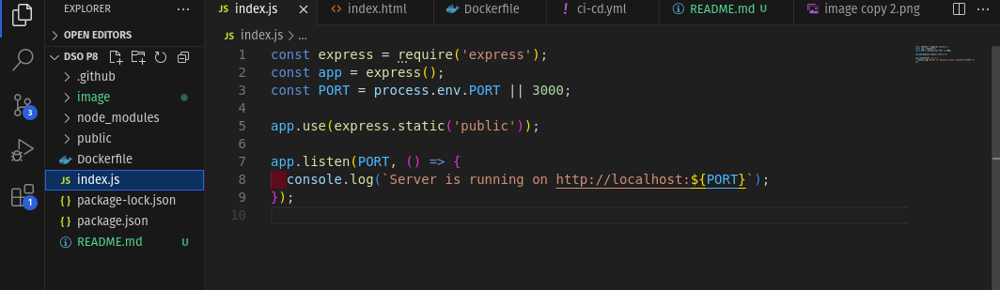
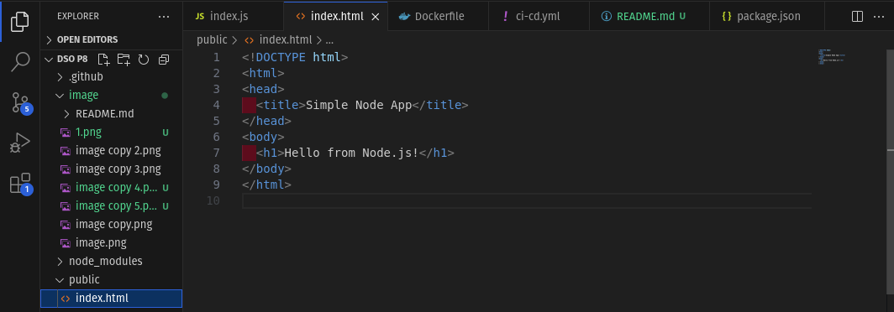
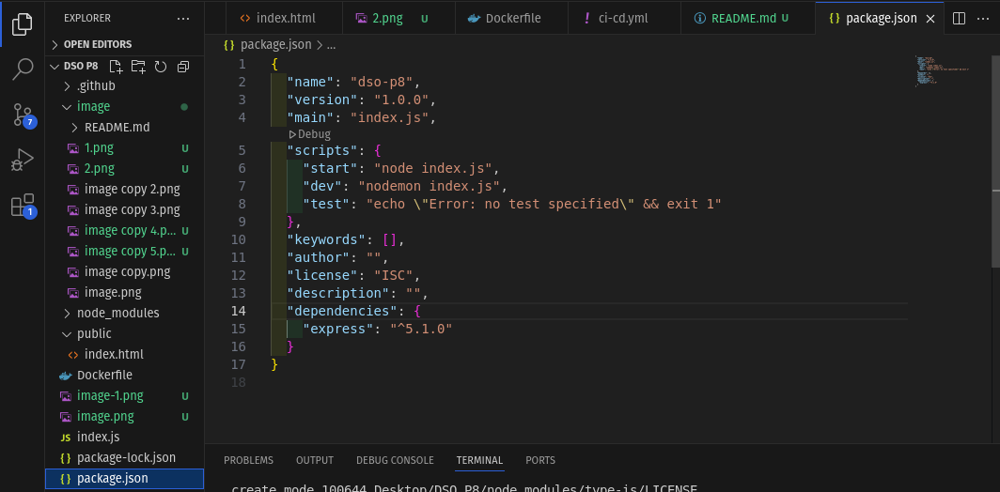
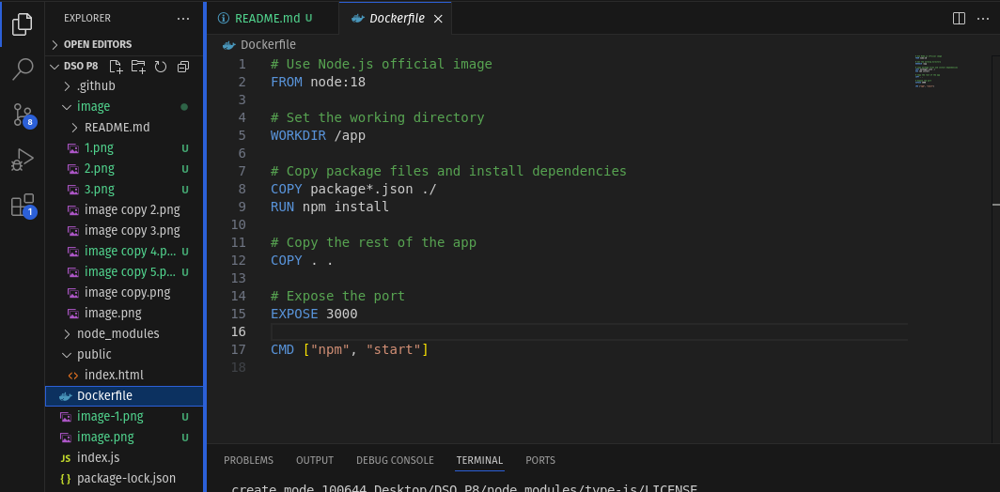
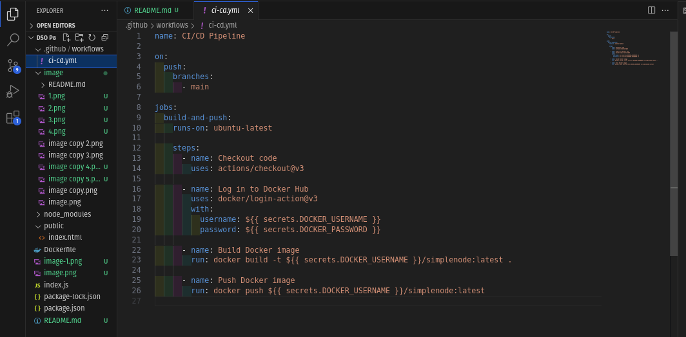
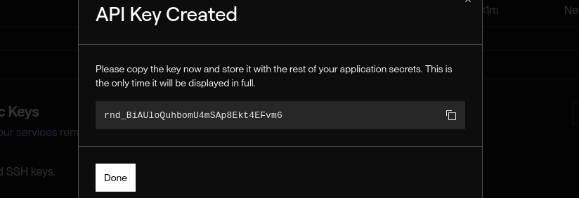
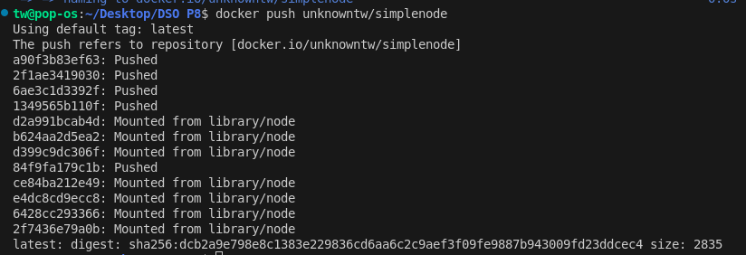
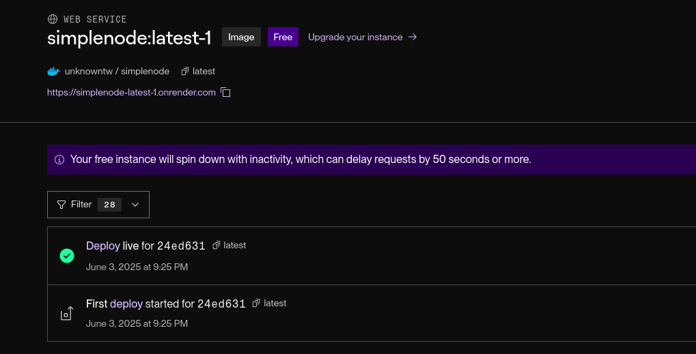
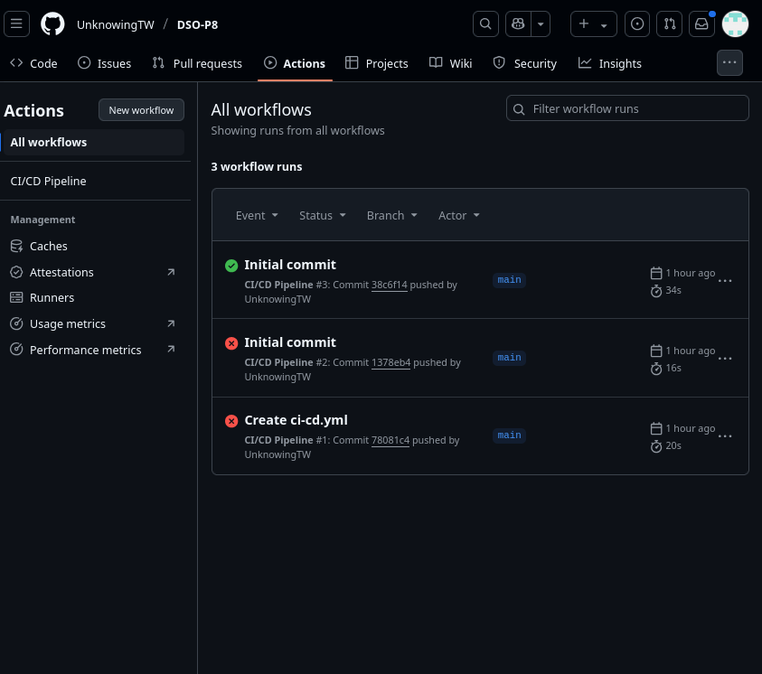

##  Practical 8: Implement a complete CICD workflow using Github actions and deploy your application

## Step-by-Step Guide

### Step 1: Create a Simple Node.js Application

i. Create Project Folder

     mkdir simple-node-app

     cd simple-node-app

ii. Initialize Node.js

     npm init -y

iii. Install Express

    npm install express

iv. Create index.js

v. Create a Public Folder and HTML File.

    mkdir public

Create a file at public/index.html with this simple content:

vi. Update package.json Scripts

Add a start script in your package.json:

### Step 2:Create a Dockerfile

Create a file named Dockerfile

### Step 3: Push Code to GitHub

i. Initialize a Git repo:

     git init
    git add .
    git commit -m "Initial commit"

ii. Create a new GitHub repo and push:

    git remote add origin https://github.com/YOUR_USERNAME/simple-node-app.git
    git branch -M main
    git push -u origin main

### Step 4: Set Up GitHub Actions Workflow

Create the directory and file:

     mkdir -p .github/workflows
     touch .github/workflows/ci-cd.yml

workflow

### Step 5: Set GitHub Secrets

Go to GitHub Repository > Settings > Secrets > Actions and add:

-  OCKER_HUB_USERNAME – your Docker Hub username

-  DOCKER_HUB_TOKEN – Docker Hub access token (create under Docker Hub > Account Settings > Security)

-  RENDER_TOKEN – Render API token (Render Dashboard > Account Settings > API Keys)

-  SERVICE_ID - live application

### Step 6: Set Up Render.com Deployment

i.Go to https://render.com and log in.

ii. Click "New" > "Web Service"

iii. Select "Deploy an existing image from a registry"

iv. Fill in:

.  Name: nodejs-ci-cd-app

.   Image: your-dockerhub-username/             nodejs-ci-cd-app:latest

.   Auto-deploy: Yes

.   Environment Variables: Add PORT=3000

.   Plan: Free

v. Click "Create Web Service"

### Step 7:  Test Your CI/CD Flow

i. Make a change (like change in index.html)

ii. Commit and push:

    git add .
    git commit -m "Test CI/CD pipeline"
    git push origin main

iii. Check the Actions tab in GitHub to see the workflow run

iv. Check Docker Hub for the updated image

vi. After success,the app is updated on Render automatically 

### Chalanges Faced & Solutions:

1. GitHub Actions Failing Due to Incorrect Secrets

.  Challange:Workflow failed because secrets like DOCKER_HUB_USERNAME, DOCKER_HUB_TOKEN, or RENDER_TOKEN were missing or misnamed.

.  Solution: Double-checked secret names in both GitHub and the YAML file, and tested secrets locally before retrying workflow runs.

2. Docker Image Push Denied

.  Challenge:Got unauthorized: incorrect username or password when pushing the Docker image.

.  Solution: Generated a token under Docker Hub → Account Settings → Security and stored it as DOCKER_HUB_TOKEN.

3.  Render Deployment Did Not Trigger

.  Challenge:Render did not  auto-deploy the new image even though GitHub Actions ran successfully.

.  Solution: Verified the Render service settings for the correct image name/tag, and ensured the webhook or token setup was correctly linked.

4. Dockerfile Performance Issues

.  Challenge:The build process was slow or the image size was too large.

.  Solution: Optimized the Dockerfile using a multi-stage build and added a .dockerignore file to skip unnecessary files.

## Conclusion:
This practical was really helpful in understanding how CI/CD works using GitHub Actions. I got to build a simple Node.js app, turn it into a Docker image, and deploy it to Render automatically. It was cool to see everything happen on its own after just pushing code. I also learned how to use secrets and connect different tools together, which made the process feel more real and chalanging.