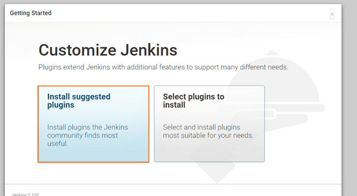
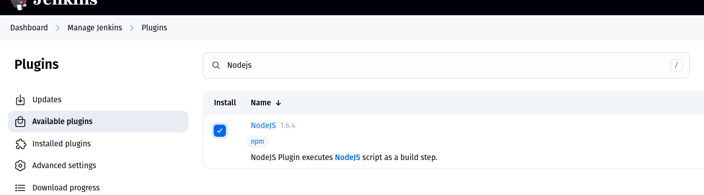
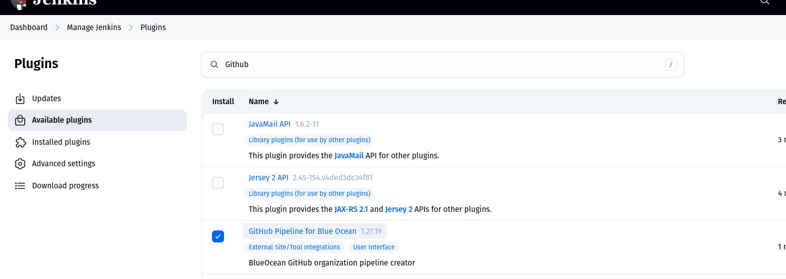
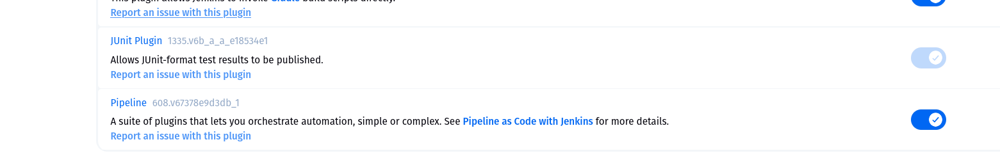

# Practical 4

# Jenkins CI/cd pipeline for Node.js Application

## Aim:
The main goal of this project was to design and execute a fully functional Continuous Integration and Continuous Deployment (CI/CD) pipeline for a Node.js application using Jenkins. This hands-on task involved:

- Installing and configuring a Jenkins server

-  Developing a Node.js application with integrated automated tests

- Building a Jenkins pipeline to automatically handle code building, testing, and deployment upon updates
## Prequasite(Tasks)

### 1. Install jenkins 

### 2. Configure Node.js in Jenkins

### 3. Nodejs Package  installation in jenkins 

### 4. Git Plugins 

### 5. Pipeline Plugins 

