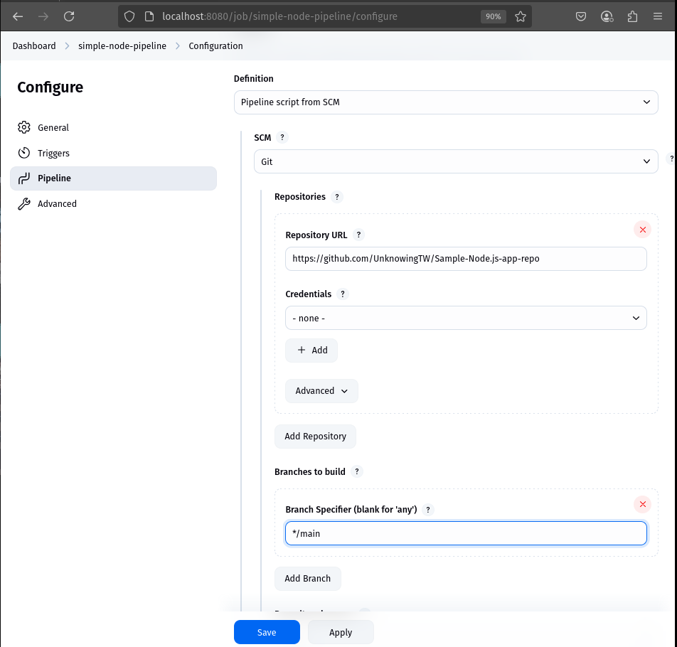
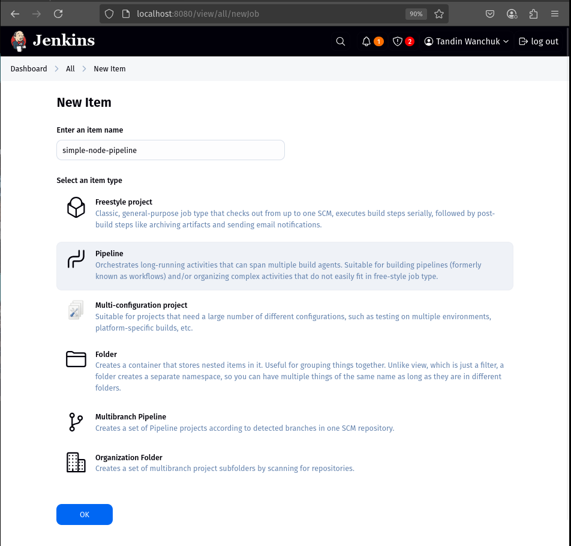
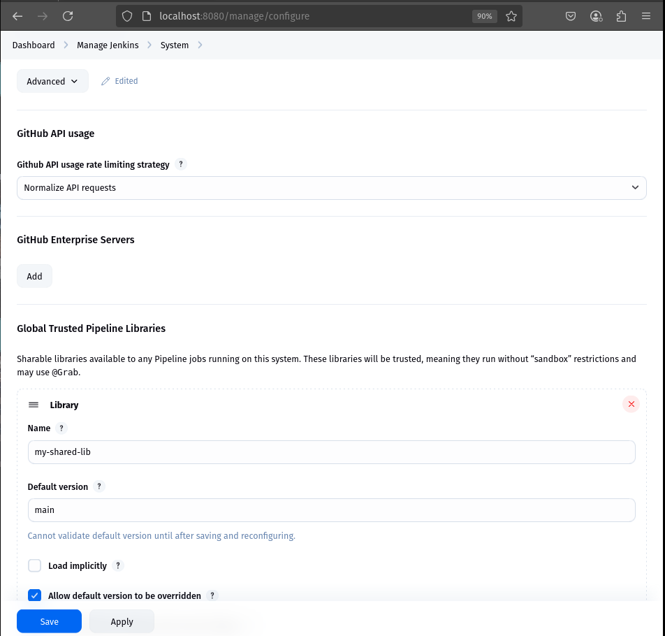

# Practical 7: Jenkins Shared Library for Node.js Applications


## Objective

The objective of this practical was to create and use a Jenkins Shared Library to centralize common CI/CD steps for Node.js applications. The shared library automates the process of installing dependencies, running tests, building Docker images, and pushing them to DockerHub. This approach promotes reusability, reduces code duplication, and simplifies pipeline maintenance.


## Project Structure

### 1. Shared Library Repository


**Location:** `/home/tw/Desktop/dsop7/Shared-Library-repo`

**Contains:**
- `vars/nodePipeline.groovy`: Groovy function with all pipeline steps
- Standard Jenkins shared library structure (vars/, src/, etc.)

```groovy
// nodePipeline.groovy (simplified)
def call(Map config = [:]) {
    ...
    sh "cd ${config.appDir} && npm install"
    ...
    withCredentials(...) {
        sh """
            echo "$PASSWORD" | docker login -u "$USERNAME" --password-stdin
            docker push ${config.imageName}
        """
    }
}
```



### 2. Node.js Application Repository

**Location:** `/home/tw/Desktop/dsop7/Sample-Node.js-app-repo`

**Contains:**
- `app.js`, `package.json`, and `Jenkinsfile`
- `Dockerfile` for image building
- `Jenkinsfile` calls the shared library

```groovy
@Library('my-shared-lib') _

pipeline {
    agent any
    stages {
        stage('Run Node Pipeline') {
            steps {
                nodePipeline(
                    appDir: '.',  
                    imageName: 'unknowntw/simple-node-app:latest'
                )
            }
        }
    }
}
```




## Jenkins Configuration

### Configured Global Shared Library
- **Path:** Manage Jenkins → Configure System
- **Name:** my-shared-lib
- **Default version:** main
- **Source:** Git (local path or GitHub repo URL)


### Configured Credentials
- DockerHub credentials added with ID: `dockerhub-creds`

### Created Pipeline Job
- **Source Code Management:** Git (points to Node.js repo)
- **Jenkinsfile path:** Jenkinsfile (at repo root)

## Steps Performed

### Step 1: Setup Shared Library
- Created `vars/nodePipeline.groovy`
- Implemented logic to:
  - Install dependencies
  - Run tests
  - Build and tag Docker image
  - Push image to DockerHub using credentials

### Step 2: Setup Node.js App Repo
- Simple Node.js app with `app.js` and `package.json`
- Created `Dockerfile`
- Added `Jenkinsfile` to call the shared library

### Step 3: Configure Jenkins
- Added global shared library
- Set up credentials
- Created and ran the Jenkins job

## Challenges Faced & Solutions

### Challenge 1: Jenkinsfile Not Found
- **Problem:** Jenkins couldn't locate the Jenkinsfile
- **Cause:** Jenkinsfile was at root, but sometimes users place it in a subfolder
- **Solution:** Ensured Jenkinsfile is correctly placed and referenced

### Challenge 2: package.json Not Found
- **Problem:** Error during npm install
- **Cause:** App files were in a subdirectory, not root
- **Solution:** Updated `nodePipeline.groovy` to support `config.appDir`

### Challenge 3: Groovy Interpolation Warning
- **Problem:** `Warning: A secret was passed to "sh" using Groovy String interpolation`
- **Cause:** Jenkins warns when secrets are used inside `"${...}"`
- **Solution:** Accepted the warning for now (best practice would be to avoid interpolation)

### Challenge 4: Docker Login Fails
- **Problem:** `Error response from daemon: unauthorized: incorrect username or password`
- **Cause:** DockerHub credentials ID was incorrect
- **Solution:** Corrected the credentials ID to `dockerhub-creds`

### Challenge 5: Shell Error - Bad Substitution
- **Problem:** `/var/lib/jenkins/workspace/.../script.sh.copy: 3: Bad substitution`
- **Cause:** Shell type mismatch — Jenkins used `/bin/sh`, but script required `/bin/bash`
- **Solution:** Updated Jenkins sh step to avoid unsupported bash syntax (no `${var//pattern/replacement}` etc.)

## Final Output

Jenkins pipeline successfully:
- Installed dependencies
- Ran tests (tolerated test failures with `|| true`)
- Built and pushed Docker image to DockerHub


**DockerHub shows image:** 


## Learning Outcomes

- Understood Jenkins Shared Library structure (vars/, src/)
- Learned how to use `withCredentials` for secure DockerHub login
- Gained experience writing and troubleshooting Groovy pipeline scripts
- Debugged common CI/CD issues like pathing, credentials, and shell syntax
- Successfully pushed Docker images from Jenkins using reusable code

## Conclusion

This practical demonstrated the  use of a Jenkins Shared Library for Node.js applications. The approach improved bit by bit and also maintained the CI/CD pipeline by isolating common logic into a shared library and  future pipelines can reuse it easily with minimal configuration.
This practical work followed best practices used in DevOps and helped us learn how to build CI/CD pipelines that can grow and be reused easily.

## Repository Links

- **Shared Library:** https://github.com/UnknowingTW/Shared-Library-repo
- **Node App:** https://github.com/UnknowingTW/Sample-Node.js-app-repo